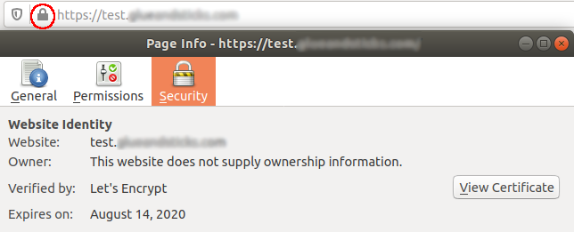

Source: https://cert-manager.io/docs/installation/kubernetes/

### Pre-reqs

- Helm v3 [installed](https://helm.sh/docs/intro/install/)
- A domain with DNS managed by DigitalOcean

**Note:** There are no charges for DNS management in DigitalOcean.

If configuring your domain for the first time, it might take up to 24 hours for DNS propagate.

....

### Create  `cert-manager` namespace

```
kubectl create namespace cert-manager
```

Switch context to use namespace

```
kubectl config set-context --current --namespace=cert-manager
```

### Install certmanager using helm

```
helm repo add jetstack https://charts.jetstack.io
helm repo update

helm upgrade -i \
cert-manager jetstack/cert-manager \
--namespace cert-manager \
--version v0.15.0 \
--set installCRDs=true
```

### Test setup (optional)

https://cert-manager.io/docs/installation/kubernetes/#verifying-the-installation

### Setup ACME LetsEncrypt issuer via DigitalOcean

Export your unique variables needed

```
export DO_PAT=DO TOKEN
export EMAIL=<email address>
export DOMAIN="example.com"
```

```
cat <<EOF | kubectl apply -f -
apiVersion: v1
kind: Secret
metadata:
  name: digitalocean-dns
  namespace: cert-manager
stringData:
  access-token: $DO_PAT
EOF
```

```
cat <<EOF | kubectl apply -f -
apiVersion: cert-manager.io/v1alpha2
kind: ClusterIssuer
metadata:
  name: digitalocean-issuer-prod
spec:
  acme:
    email: $EMAIL
    server: https://acme-v02.api.letsencrypt.org/directory
    privateKeySecretRef:
      # Secret resource that will be used to store the account's private key.
      name: letsencrypt-prod
    solvers:
    - dns01:
        digitalocean:
          tokenSecretRef:
            name: digitalocean-dns
            key: access-token
EOF
```

Validate status:

```
kubectl describe clusterissuer digitalocean-issuer-prod
```

### Test with a dummy nginx container

Set namespace context

```
kubectl config set-context --current --namespace=default
```

Create a nginx deployment

```
kubectl create deployment nginx --image=nginx
```

Create a service (expose) the deployment

```
kubectl expose deployment/nginx --port 80
```

Create an ingress object to accept external traffic. Using the `force-ssl-redirect` annotation will force HTTPS traffic using our cert.

```
# replace example.com with your domain
export DOMAIN="example.com"

cat <<EOF | kubectl apply -f -
apiVersion: networking.k8s.io/v1beta1
kind: Ingress
metadata:
  annotations:
    cert-manager.io/cluster-issuer: digitalocean-issuer-prod
  name: test
spec:
  rules:
    - host: test.${DOMAIN}
      http:
        paths:
          - backend:
              serviceName: nginx
              servicePort: 80
            path: /
  tls: # < placing a host in the TLS config will indicate a certificate should be created
  - hosts:
    - test.${DOMAIN}
    secretName: myingress-cert # < cert-manager will store the created certificate in this secret.
EOF
```

Wait for certificate to be issued by monitoring `kubectl get orders`. Once STATE is `valid` visit URL in a web browser.



### Clean up

Set namespace context

```
kubectl config set-context --current --namespace=default
```

Delete the nginx test deployment

```
kubectl delete deployment nginx
kubectl delete service nginx
kubectl delete ingress test
```