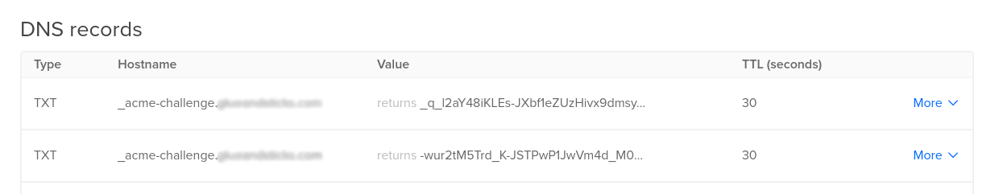

Source: https://kubernetes.github.io/ingress-nginx/deploy/#using-helm

### Pre-reqs

- Helm v3 [installed](https://helm.sh/docs/intro/install/)
- DigitalOcean [Cloud Controller Manager](add-digitalocean-ccm.md) deployed
- Own a domain
- Ability to create and update DNS records

Before you start, make sure your domain is setup to use DNS. I'm using DigitalOcean. You could use Cloudflare or your domain providers DNS. For help, Google "how to create TXT record with YOUR_DNS_PROVIDER."

If configuring your domain for the first time, it might take up to 24 hours for DNS propagate.

### Create free wildcard SSL certificate

We will use the control plane node to generate the certificate so the instructions remain the same for everyone.

1) ssh into control plane

    ```
    ssh root@$(terraform output -json control_plane_ip | jq -r .[0])
    ```

1) Install certbot (LetsEncrypt) 

    ```
    apt install certbot -y
    ```

1) Request certificate generation

    ```
    # replace example.com with your domain
    export DOMAIN="example.com"
    
    certbot certonly --manual --agree-tos \
    --manual-public-ip-logging-ok \
    --register-unsafely-without-email \
    --preferred-challenges=dns \
    -d *.${DOMAIN} -d ${DOMAIN}
    ```

    It will ask you to create **two** DNS TXT records (one for the wildcard and one for the domain). You can create the TXT records with the same name. I set the TTL to 30 seconds just in case I need redo anything, I don't need to wait the standard 3600 (1 hour).

    

    ```
    IMPORTANT NOTES:
     - Congratulations! Your certificate and chain have been saved at:
       /etc/letsencrypt/live/example.com/fullchain.pem
       Your key file has been saved at:
       /etc/letsencrypt/live/example.com/privkey.pem
    ```

    Since you are creating the certs manually, you will have to manually renew them in 3 months. Alternately, you can can google ways to automatically renew. I plan on destroying the cluster / certs before renewing so that is not a problem.

1) Create TLS secret in Kubernetes

    ```
    kubectl create secret tls my-cert \
    --cert=/etc/letsencrypt/live/${DOMAIN}/fullchain.pem \
    --key=/etc/letsencrypt/live/${DOMAIN}/privkey.pem
    ```

### Install ingress controllers using helm

If still SSHed into the control plane, `exit` back to your terminal.

1) Add stable repo to helm

    ```
    helm repo add stable https://kubernetes-charts.storage.googleapis.com
    ```

1) Install ingress controllers using default TLS cert

    ```
    helm upgrade -i nginx stable/nginx-ingress \
    --version "1.37.0" \
    --set controller.extraArgs.default-ssl-certificate="default/my-cert"
    ```

### Configure DNS

Wait for ingress service LoadBalancer `<pending>` EXTERNAL-IP to be generated.

```
kubectl get service
NAME                                  TYPE           CLUSTER-IP       EXTERNAL-IP   PORT(S)                      AGE
nginx-nginx-ingress-controller        LoadBalancer   10.97.183.148    <pending>     80:30511/TCP,443:31594/TCP   30s

```

```
kubectl get service
NAME                                  TYPE           CLUSTER-IP       EXTERNAL-IP     PORT(S)                      AGE
nginx-nginx-ingress-controller        LoadBalancer   10.97.183.148    159.89.253.14   80:30511/TCP,443:31594/TCP   2m17s
```

Create two DNS A records with the value of your IP.
- Create an A record with the hostname `*`
- Create an A record with the hostname `@`

The `*` record will direct all subdomains to your loadbalancer and the `@` record will direct all domain (example.com) traffic to the loadbalancer.

Example:


### Test with a dummy nginx container

Create a nginx deployment

```
kubectl create deployment nginx --image=nginx
```

Create a service (expose) the deployment

```
kubectl expose deployment/nginx --port 80
```

Create an ingress object to accept external traffic. Using the `force-ssl-redirect` annotation will force HTTPS traffic using our cert.

```
# replace example.com with your domain
export DOMAIN="example.com"

cat <<EOF | kubectl apply -f -
apiVersion: networking.k8s.io/v1beta1
kind: Ingress
metadata:
  annotations:
    nginx.ingress.kubernetes.io/force-ssl-redirect: "true"
  name: test
spec:
  rules:
    - host: test.${DOMAIN}
      http:
        paths:
          - backend:
              serviceName: nginx
              servicePort: 80
            path: /
EOF
```

Visit URL in a web browser.


### Clean up

Delete the nginx test deployment

```
kubectl delete deployment nginx
kubectl delete service nginx
kubectl delete ingress test
```

Delete the ingress controllers

```
helm delete nginx
```