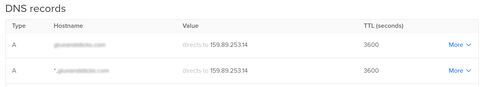

Source: https://kubernetes.github.io/ingress-nginx/deploy/#using-helm

### Pre-reqs

- Helm v3 [installed](https://helm.sh/docs/intro/install/)
- DigitalOcean [Cloud Controller Manager](add-digitalocean-ccm.md) deployed
- Ability to create DNS records for a public domain

Before you start, make sure your domain is setup to use DNS. I'm using DigitalOcean. You could use Cloudflare or your domain providers DNS. For help, Google "how to create TXT record with YOUR_DNS_PROVIDER."

**Note:** There are no charges for DNS management in DigitalOcean.

If configuring your domain for the first time, it might take up to 24 hours for DNS propagate.

### Install ingress controllers using helm

If still SSHed into the control plane, `exit` back to your terminal.

1) Create `ingress-nginx` namespace

    ```
    kubectl create namespace ingress-nginx
    ```

Switch context to use namespace

```
kubectl config set-context --current --namespace=ingress-nginx
```

1) Add stable repo to helm

    ```
    helm repo add stable https://kubernetes-charts.storage.googleapis.com
    ```

1) Install ingress controllers using default TLS cert

    ```
    helm upgrade -i nginx stable/nginx-ingress \
    --namespace="ingress-nginx" \
    --version="1.37.0"
    ```

### Configure DNS

Wait for ingress service LoadBalancer `<pending>` EXTERNAL-IP to be generated.

```
kubectl get service nginx-nginx-ingress-controller
NAME                                  TYPE           CLUSTER-IP       EXTERNAL-IP   PORT(S)                      AGE
nginx-nginx-ingress-controller        LoadBalancer   10.97.183.148    <pending>     80:30511/TCP,443:31594/TCP   30s

```

```
kubectl get service nginx-nginx-ingress-controller
NAME                                  TYPE           CLUSTER-IP       EXTERNAL-IP     PORT(S)                      AGE
nginx-nginx-ingress-controller        LoadBalancer   10.97.183.148    159.89.253.14   80:30511/TCP,443:31594/TCP   2m17s
```

Create two DNS A records with the value of your IP.
- Create an A record with the hostname `*`
- Create an A record with the hostname `@`

The `*` record will direct all subdomains to your loadbalancer and the `@` record will direct all domain (example.com) traffic to the loadbalancer.

Example:




### Test with a dummy nginx container

Set namespace context

```
kubectl config set-context --current --namespace=default
```

Create a nginx deployment

```
kubectl create deployment nginx --image=nginx
```

Create a service (expose) the deployment

```
kubectl expose deployment/nginx --port 80
```

Create an ingress object to accept external traffic. Using the `force-ssl-redirect` annotation will force HTTPS traffic using our cert.

```
# replace example.com with your domain
export DOMAIN="example.com"

cat <<EOF | kubectl apply -f -
apiVersion: networking.k8s.io/v1beta1
kind: Ingress
metadata:
  annotations:
  name: test
spec:
  rules:
    - host: test.${DOMAIN}
      http:
        paths:
          - backend:
              serviceName: nginx
              servicePort: 80
            path: /
EOF
```

Visit URL (test.example.com) in a web browser.

### Clean up

Set namespace context

```
kubectl config set-context --current --namespace=default
```

Delete the nginx test deployment

```
kubectl delete deployment nginx
kubectl delete service nginx
kubectl delete ingress test
```

Delete the ingress controllers

```
helm delete nginx -n ingress-nginx
```