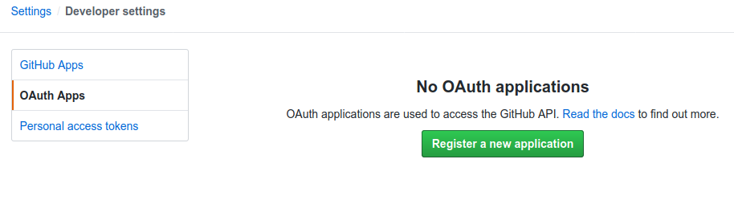
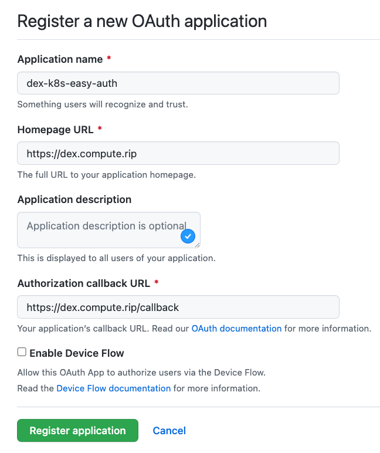
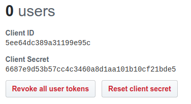

Source: https://github.com/helm/charts/blob/master/stable/dex/values.yaml
Source: https://github.com/dexidp/dex/blob/master/Documentation/kubernetes.md

### Pre-reqs

- Helm v3 [installed](https://helm.sh/docs/intro/install/)
- [Ingress Controller](ingress-controller.md) deployed
- [cert-manager](certmanager.md) deployed (semi-optional)

### Setup API servers

Assuming you're using let's encrypt, let's create the CA cert

```
# ssh into the control plane node


curl https://letsencrypt.org/certs/isrgrootx1.pem.txt > isrgrootx1.pem.txt
curl https://letsencrypt.org/certs/lets-encrypt-x3-cross-signed.pem.txt > lets-encrypt-x3-cross-signed.pem.txt
cat isrgrootx1.pem.txt lets-encrypt-x3-cross-signed.pem.txt > letsencrypt.pem

# move to kubernetes pki
cp letsencrypt.pem /etc/kubernetes/pki/letsencrypt.pem
```

This can be setup w/o impact to existing auth / access

(leverage kubeadm NOT sed)

```
vi /etc/kubernetes/manifests/kube-apiserver.yaml

    - --oidc-ca-file=/etc/kubernetes/pki/letsencrypt.pem
    - --oidc-client-id=gangway
    - --oidc-groups-claim=groups
    - --oidc-issuer-url=https://dex.glueandsticks.com
    - --oidc-username-claim=email

exit
```

https://community.letsencrypt.org/t/whats-the-ca-file-does-letsencrypt-even-create-one/26430/5

### Setup an OAUTH app in Github

GitHub > Profile > Settings > Devopler Settings > OAuth Apps > Register a new application



Settings:



### Export clientID and Secret

ClientID / Secret



```
export CLIENT_ID=4f7fc5a0a8e83cc5084d
export CLIENT_SECRET=3660aefd02f21695451b7a6bebfb2694a0f7700d
```

### Install Dex

1) Create `auth-system` namespace

   ```
   kubectl create namespace auth-system
   ```

1) Switch context to use `auth-system` namespace

    ```
    kubectl config set-context --current --namespace=auth-system
    ```

1) Add stable repo to helm

    ```
    helm repo add stable https://kubernetes-charts.storage.googleapis.com
    ```

1) Install ingress controllers using default TLS cert

```
export DOMAIN="example.com"

helm upgrade -i dex-helm stable/dex \
--namespace "auth-system" \
--version "2.11.0" \
--set certs.web.create=false \
--set certs.grpc.create=false \
--set https=true \
--set ingress.enabled=true \
--set ingress.hosts[0]="dex.${DOMAIN}" \
--set ingress.annotations."nginx\.ingress\.kubernetes\.io/force-ssl-redirect"=\"true\" \
--set ingress.annotations."nginx\.ingress\.kubernetes\.io/backend-protocol"="HTTPS" \
--set ingress.annotations."cert-manager\.io/cluster-issuer"="digitalocean-issuer-prod" \
--set ingress.tls[0].hosts[0]="dex.${DOMAIN}" \
--set ingress.tls[0].secretName="dex-secret" \
--set grpc=false \
--set certs.web.secret.tlsName="dex-secret" \
--set config.enablePasswordDB=false \
--set config.issuer=https://dex.${DOMAIN} \
--set config.connectors[0].type="github" \
--set config.connectors[0].id="github" \
--set config.connectors[0].name="GitHub" \
--set config.connectors[0].config.clientID="${CLIENT_ID}" \
--set config.connectors[0].config.clientSecret="${CLIENT_SECRET}" \
--set config.connectors[0].config.redirectURI="https://dex.${DOMAIN}/callback" \
--set config.staticClients[0].id="gangway" \
--set config.staticClients[0].redirectURIs[0]="https://gangway.${DOMAIN}/callback" \
--set config.staticClients[0].name="Testing OIDC" \
--set config.staticClients[0].secret="ZXhhbXBsZS1hcHAtc2VjcmV0"

# without cert-manager replace the following:

--set ingress.annotations."cert-manager\.io/cluster-issuer"="digitalocean-issuer-prod" \
--set ingress.tls[0].hosts[0]="dex.${DOMAIN}" \
--set ingress.tls[0].secretName="dex-secret" \
```

Validate cert is not `pending` with:

```
watch kubectl get orders
```

Once the order is `valid` check Dex at (replace domain): https://dex.glueandsticks.com/.well-known/openid-configuration

### Install gangway

Gangway is a web app to issue kubeconfig files. There is talk that it will eventually be integrated with Dex. Untill then:

```
helm upgrade -i gangway-helm stable/gangway \
--namespace "auth-system" \
--version "0.4.2" \
--set gangway.clusterName="test-cluster" \
--set gangway.usernameClaim="email" \
--set gangway.audience="https://dex.${DOMAIN}/userinfo" \
--set gangway.authorizeURL="https://dex.${DOMAIN}/auth" \
--set gangway.tokenURL="https://dex.${DOMAIN}/token" \
--set gangway.redirectURL="https://gangway.${DOMAIN}/callback" \
--set gangway.apiServerURL="$(kubectl config view --raw -o json --minify | jq -r '.clusters[0].cluster.server')" \
--set gangway.clientID="gangway" \
--set gangway.clientSecret="ZXhhbXBsZS1hcHAtc2VjcmV0" \
--set ingress.enabled=true \
--set ingress.hosts[0]="gangway.${DOMAIN}" \
--set ingress.annotations."nginx\.ingress\.kubernetes\.io/force-ssl-redirect"=\"true\" \
--set ingress.annotations."cert-manager\.io/cluster-issuer"="digitalocean-issuer-prod" \
--set ingress.tls[0].hosts[0]="gangway.${DOMAIN}" \
--set ingress.tls[0].secretName="gangway-secret"
```

> Note: test-cluster will be the cluster name in your kubeconfig. Make unique if multiple clusters

Make sure the container is `Running` with:

```
watch kubectl get pods
```

Validate cert is not `pending` with:

```
watch kubectl get orders
```

Once the order is `valid`

Once `Running` check Gangway at: https://gangway.glueandsticks.com/

### Test

Login to github via gangway auth

- Download kubeconfig

- Create admin rolebinding for github email

    ```
    kubectl create clusterrolebinding cluster-admin-binding-test --clusterrole cluster-admin --user jameswangel@gmail.com
    ```

- Test kubeconfig

    ```
    kubectl get pods -A --kubeconfig="<PATH-TO-KUBECONFIG>"
    
    # example: kubectl get pods -A --kubeconfig="/home/jimangel/Downloads/kubeconf"
    ```

### Cleanup

```
kubectl config set-context --current --namespace=auth-system
helm delete dex-helm
helm delete gangway-helm
```

### TODO

Add a diagram of each component flow...
