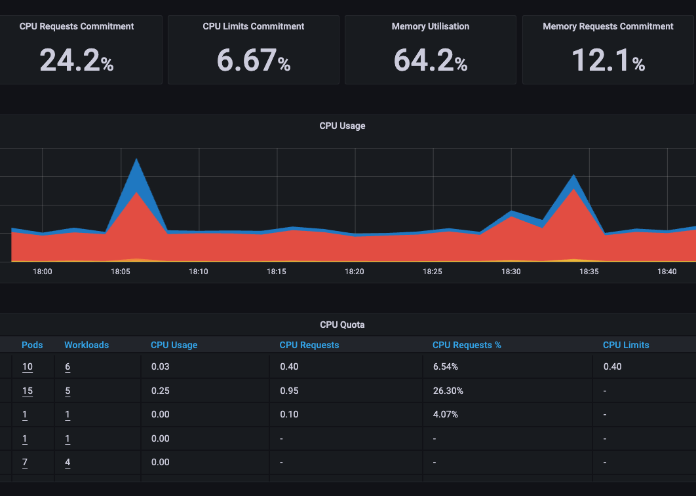

Source: https://github.com/helm/charts/tree/master/stable/prometheus-operator

### Pre-reqs

- Helm v3 [installed](https://helm.sh/docs/intro/install/)
- [Ingress Controller](ingress-controller.md) deployed
- [cert-manager](certmanager.md) deployed (semi-optional)

### Overview

Prometheus Operator allows you to create a monitoring stack for your cluster consisting of Prometheus, Grafana, and Alertmanager. There's a great overview of these components in [Eduardo Baitello's medium post](https://medium.com/faun/trying-prometheus-operator-with-helm-minikube-b617a2dccfa3).

### Set Parameters

We will use gmail as the alerting method of choice. That means we need to provide our email and password. For security sake, you shouldn't use your main Gmail password. Instead generate an [app password](https://support.google.com/accounts/answer/185833).

Direct link to create: https://myaccount.google.com/apppasswords

- Select app: Mail
- Select device: Other (custom name)
- Name: prometheus > Generate

Once that's done, run the following in a shell, substituting in your Gmail address and app password: 

```
export GMAIL_ACCOUNT="email@example.com"      # Substitute in your full gmail address here.
export GMAIL_AUTH_TOKEN="################"       # Substitute in your app password
```

This tutorial assumes you already have the `DOMAIN` variable set:

```
export DOMAIN="example.com"
```

### Create the namespace and change context

```
kubectl create namespace monitoring
kubectl config set-context --current --namespace=monitoring
```

### Add and update helm

```
helm repo add prometheus-community https://prometheus-community.github.io/helm-charts
helm repo update
```

### Deploy the prometheus operator via helm

There's a LOT of flags set here. I highly recommend reviewing all options `helm show values prometheus-community/kube-prometheus-stack`

A couple key items that you may want to be aware of:
- Create no rules with `--set defaultRules.create=false` which is great for supplying custom rules after deploying.
  - Default rules are found [here](https://github.com/prometheus-community/helm-charts/tree/main/charts/kube-prometheus-stack/templates/prometheus/rules-1.14)
- Change Grafana's password with `--set grafana.adminPassword="YOUR-PASSWORD"`
- Change the runbook URL with `--set defaultRules.runbookUrl` defaults to https://github.com/kubernetes-monitoring/kubernetes-mixin/tree/master/runbook.md#
- `--set kubeProxy.enabled=false` will prevent a service and serviceMonitor from scraping the Kubernetes proxy
- `--set kubeEtcd.enabled=false` will prevent etcd from being scraped
- `--set defaultRules.appNamespacesTarget="kube-system|monitoring|<other-namespace>"` to only alert on specific namespaces.
- `--version` is the CHART version, not the APP version ([source](https://github.com/prometheus-community/helm-charts/blob/main/charts/kube-prometheus-stack/Chart.yaml#L24))

Be aware that, by default, Alertmanager and Prometheus GUI's are exposed with no log in. If that is a concern, you may consider removing the `ingress.enabled=` values and only access the UI via `kubectl proxy`.

```
# TIPS:
# helm show values prometheus-community/kube-prometheus-stack | yq
# use `noglob` on mac: https://stackoverflow.com/questions/63327027/slice-in-helm-no-matches-found

noglob helm upgrade -i prometheus-app prometheus-community/kube-prometheus-stack \
--namespace monitoring \
--create-namespace \
--version "45.8.0" \
--set prometheus.ingress.enabled=true \
--set kubeProxy.enabled=false \
--set kubeEtcd.enabled=false \
--set prometheus.ingress.ingressClassName=nginx \
--set prometheus.ingress.hosts[0]="prometheus.${DOMAIN}" \
--set prometheus.ingress.annotations."cert-manager\.io/cluster-issuer"="digitalocean-issuer-prod" \
--set prometheus.ingress.tls[0].hosts[0]="prometheus.${DOMAIN}" \
--set prometheus.ingress.tls[0].secretName="prometheus-secret" \
--set grafana.adminPassword='H4Rd2Gu3ss!' \
--set grafana.ingress.enabled=true \
--set grafana.ingress.ingressClassName=nginx \
--set grafana.ingress.hosts[0]="grafana.${DOMAIN}" \
--set grafana.ingress.annotations."cert-manager\.io/cluster-issuer"="digitalocean-issuer-prod" \
--set grafana.ingress.tls[0].hosts[0]="grafana.${DOMAIN}" \
--set grafana.ingress.tls[0].secretName="grafana-secret" \
--set alertmanager.ingress.enabled=true \
--set alertmanager.ingress.ingressClassName=nginx \
--set alertmanager.alertmanagerSpec.externalUrl="https://alertmanager.${DOMAIN}" \
--set alertmanager.ingress.hosts[0]="alertmanager.${DOMAIN}" \
--set alertmanager.ingress.annotations."cert-manager\.io/cluster-issuer"="digitalocean-issuer-prod" \
--set alertmanager.ingress.tls[0].hosts[0]="alertmanager.${DOMAIN}" \
--set alertmanager.ingress.tls[0].secretName="alertmanager-secret" \
-f - <<EOF
alertmanager:
  config:
    global:
      resolve_timeout: 5m
    route:
      group_by: ['alertname', 'job']
      group_wait: 30s
      group_interval: 5m
      repeat_interval: 12h
      receiver: email-me
      routes:
      - match:
          alertname: Watchdog
        receiver: 'null'
    receivers:
    - name: 'null'
    - name: email-me
      email_configs:
      - to: $GMAIL_ACCOUNT
        from: $GMAIL_ACCOUNT
        smarthost: smtp.gmail.com:587
        auth_username: "$GMAIL_ACCOUNT"
        auth_identity: "$GMAIL_ACCOUNT"
        auth_password: "$GMAIL_AUTH_TOKEN"
EOF
```

### Check it out!

Once deployed you should be able to visit any of the following URLs:
- prometheus.example.com
- alertmanager.example.com
- grafana.example.com (user: admin password: H4Rd2Gu3ss!)



You can also check that all targets are up: https://prometheus.YOUR_URL_DOT_COM/targets

> Note: I use a `kubeadm` config template [here](../kubeadm-config.tpl) that specifies components bind to `0.0.0.0` vs. `localhost` for scraping. If you find some targets are down, this issue might help: https://github.com/prometheus-community/helm-charts/issues/204#issuecomment-788065305

### Configure alertmanager beyond the default HTML email

There's two components in alerting, a configuration of alertmanager which instructs WHERE alerts are sent and a template file (configmap) that instructs HOW alerts are composed.

If you'd like to send alerts to Slack or change the HTML template to PlainText, you can! There's a ton of information in the main docs https://prometheus.io/docs/alerting/latest/configuration/. For more template inspiration check out https://prometheus.io/docs/alerting/latest/notification_examples/ and google.

Create a ConfigMap and update your alertmanager settings to use the template.

#### Creating the ConfigMap

Create the template file laying out exactly how you want alerts to look. You can also define new variables here such as cluster friendly names. If this example were for slack, I might reduce the amount of data being sent in one alert.

```
cat << EOF > /tmp/custom.tmpl
{{/* this is the cluster friendly name datacenter - env - name - zone */}}
{{ define "__clusterName"}}TEST - EXAMPLE - CLUSTER{{end}}

{{/* this is for subject of email in form datacenter - env - name - zone - X Alerts Firing - K8sAlertmanager*/}}
{{ define "__subject" }} {{ template "__clusterName" .}} - {{ if eq .Status "firing" }}{{ .Alerts.Firing | len }} Alert{{ if gt (len .Alerts.Firing) 1 }}s{{end}} Firing - {{ if .CommonLabels.alertname }}{{ .CommonLabels.alertname }}{{else}}{{ (index .Alerts.Firing 0).Labels.alertname }}{{end}} - K8sAlertmanager {{ end }}{{ end }}

{{/* used for the button that links to alert manger in html email */}}
{{ define "__alertmanagerURL" }}{{ .ExternalURL }}/#/alerts?receiver={{ .Receiver }}{{ end }}

{{/* this overwrites the email subject in alertmanager.yaml */}}
{{ define "email.custom.subject" }}
        {{ template "__subject" . }}
{{ end }}

{{/*** HTML Tempalte ***/}}
{{ define "email.custom.html" }}
<!DOCTYPE html>
<html>
  <head>
      <title>{{ template "__subject" . }}</title>
  </head>

  <body>
        {{ if gt (len .Alerts.Firing) 0 }}
        <span style="color: blue; size: 35;"> {{ template "__clusterName" .}}  </span><br/><br/>
        <a href="{{ template "__alertmanagerURL" . }}" style=" border: 12px solid #348eda; pading: 60; color: #FFF; text-align: center; cursor: pointer; background-color: #348eda; margin-right: 100;">View in Alertmanager</a>
        <a href= "{{ .CommonAnnotations.runbook_url }}" style="border: 12px solid #348eda; pading: 60; color: #FFF; text-align: center; cursor: pointer; background-color: #348eda;">Knowledge Base</a><br/>
          <hr/><br/>
          {{ range .Alerts.Firing }}
            <table>
            {{if .Labels.alertname }}<tr><tr><strong class="base">Alertname: </strong></td><td>{{ .Labels.alertname }}</td></tr>{{end}}
            {{if .Labels.cluster }}<tr><td><strong class="base">Cluster: </strong></td><td>{{ .Labels.cluster }}</td></tr>{{end}}
            {{if .Annotations.message }}<tr><tr><strong class="base">Details: </strong></td><td>{{ .Annotations.message }}</td></tr>{{end}}
            {{if .Labels.severity }}<tr><td><strong class="base">Severity: </strong></td><td>{{ .Labels.severity }}</td></tr>{{end}}
            {{if .Labels.statefulset }}<tr><td><strong class="base">Statefulset: </strong></td><td>{{ .Labels.statefulset }}</td></tr>{{end}}
            {{if .Labels.namespace }}<tr><td><strong class="base">Namespace: </strong></td><td>{{ .Labels.namespace }}</td></tr>{{end}}
            {{if .Labels.instance }}<tr><td><strong class="base">Target: </strong></td><td>{{ .Labels.instance }}</td></tr>{{end}}
            <tr><td><strong class="base">Start Time: </strong></td><td>{{ .StartsAt }}</td></tr>
            {{if .Labels.prometheus }}<tr><td><strong class="base">Prometheus Instance: </strong></td><td>{{ .Labels.prometheus }}</td></tr>{{end}}
            {{if .Labels.job }}<tr><td><strong class="base">Job: </strong></td><td>{{ .Labels.job }}</td></tr>{{end}}
            {{if .Labels.pod }}<tr><td><strong class="base">Pod: </strong></td><td>{{ .Labels.pod }}</td></tr>{{end}}
            {{if .Labels.service }}<tr><td><strong class="base">Service: </strong></td><td>{{ .Labels.service }}</td></tr>{{end}}
            </table>
            <a href= "{{ .GeneratorURL }}" style="border: 12px solid #348eda; pading: 60; color: #FFF; text-align: center; cursor: pointer; background-color: #348eda;">View in Prometheus</a><br/>
            <hr/><br/>
        {{ end }}
      {{ end }}
    <a href="{{ .ExternalURL }}" style="color: #999; text-decoration: underline;">Sent by Alertmanager</a>
  </body>
</html>
{{ end }}
EOF
```

Create the ConfigMap

```
kubectl -n monitoring create configmap alert-template --from-file=/tmp/custom.tmpl
```

#### Update the helm CLI values

Append the helm value to use the ConfigMap

```
--set alertmanager.alertmanagerSpec.configMaps[0]="alert-template" \
```

And update alertmanager config to use a template:

```
...
    receivers:
      email_configs:
        ...
        html: '{{ template "email.custom.html" . }}'
        headers:
          subject: '{{ template "__subject" . }}'
    templates:
    - '/etc/alertmanager/configmaps/alert-template/*.tmpl'  
...
```

Re-run the ENTIRE helm command again with the new changes:

```
noglob helm upgrade -i prometheus-app prometheus-community/kube-prometheus-stack \
--namespace monitoring \
--create-namespace \
--version "45.8.0" \
--set prometheus.ingress.enabled=true \
--set kubeProxy.enabled=false \
--set kubeEtcd.enabled=false \
--set prometheus.ingress.ingressClassName=nginx \
--set prometheus.ingress.hosts[0]="prometheus.${DOMAIN}" \
--set prometheus.ingress.annotations."cert-manager\.io/cluster-issuer"="digitalocean-issuer-prod" \
--set prometheus.ingress.tls[0].hosts[0]="prometheus.${DOMAIN}" \
--set prometheus.ingress.tls[0].secretName="prometheus-secret" \
--set grafana.adminPassword='H4Rd2Gu3ss!' \
--set grafana.ingress.enabled=true \
--set grafana.ingress.ingressClassName=nginx \
--set grafana.ingress.hosts[0]="grafana.${DOMAIN}" \
--set grafana.ingress.annotations."cert-manager\.io/cluster-issuer"="digitalocean-issuer-prod" \
--set grafana.ingress.tls[0].hosts[0]="grafana.${DOMAIN}" \
--set grafana.ingress.tls[0].secretName="grafana-secret" \
--set alertmanager.ingress.enabled=true \
--set alertmanager.ingress.ingressClassName=nginx \
--set alertmanager.alertmanagerSpec.externalUrl="https://alertmanager.${DOMAIN}" \
--set alertmanager.alertmanagerSpec.configMaps[0]="alert-template" \
--set alertmanager.ingress.hosts[0]="alertmanager.${DOMAIN}" \
--set alertmanager.ingress.annotations."cert-manager\.io/cluster-issuer"="digitalocean-issuer-prod" \
--set alertmanager.ingress.tls[0].hosts[0]="alertmanager.${DOMAIN}" \
--set alertmanager.ingress.tls[0].secretName="alertmanager-secret" \
-f - <<EOF
alertmanager:
  config:
    global:
      resolve_timeout: 5m
    route:
      group_by: ['alertname', 'job']
      group_wait: 30s
      group_interval: 5m
      repeat_interval: 12h
      receiver: email-me
      routes:
      - match:
          alertname: Watchdog
        receiver: 'null'
    receivers:
    - name: 'null'
    - name: email-me
      email_configs:
      - to: $GMAIL_ACCOUNT
        from: $GMAIL_ACCOUNT
        smarthost: smtp.gmail.com:587
        auth_username: "$GMAIL_ACCOUNT"
        auth_identity: "$GMAIL_ACCOUNT"
        auth_password: "$GMAIL_AUTH_TOKEN"
        html: '{{ template "email.custom.html" . }}'
        headers:
          subject: '{{ template "__subject" . }}'
    templates:
    - '/etc/alertmanager/configmaps/alert-template/*.tmpl'  
EOF
```

### Test alerting

**TODO:** I need to create a better test. I originally killed a node to test, which worked. However, most recently I did the same test and destroyed the node that was running many of the alerting components. One option would be to remove the "'- match' route directing alerts to the 'null' receiver" for Watchdog alerts (that always fire).

```
# delete this and reapply
      routes:
      - match:
          alertname: Watchdog
        receiver: 'null'
```

### Cleanup

```
helm delete prometheus-app --namespace "monitoring"
```

> Note: If you created an GMAIL_AUTH_TOKEN and don't plan on using it again, it would be best to delete it entirely. https://myaccount.google.com/apppasswords